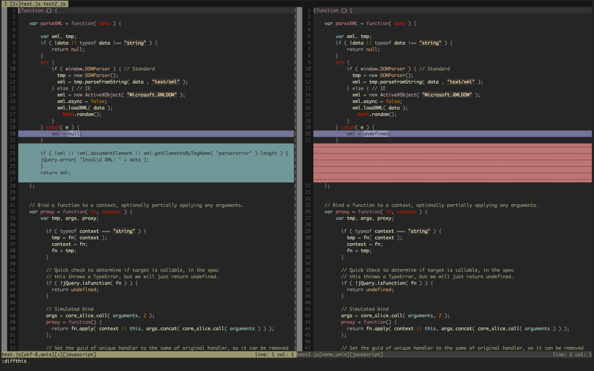
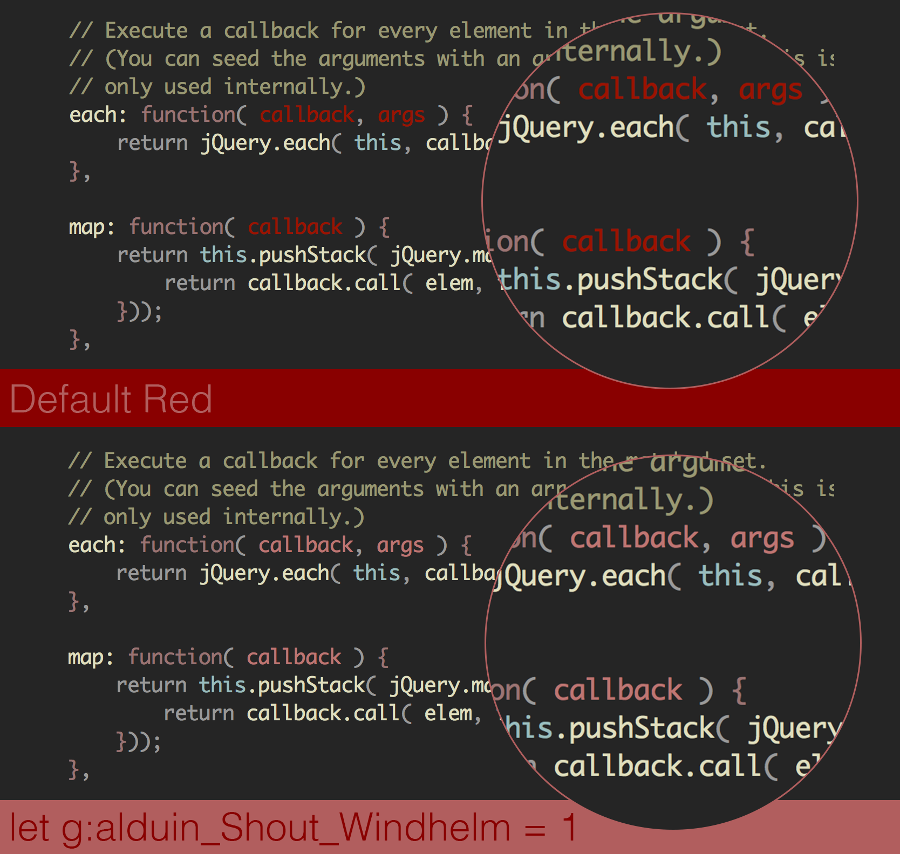

        ___                            
       -   -_, ,,  |\                  
      (  ~/||  ||   \\         '       
      (  / ||  ||  / \\ \\ \\ \\ \\/\\ 
       \/==||  || || || || || || || || 
       /_ _||  || || || || || || || || 
      (  - \\, \\  \\/  \\/\\ \\ \\ \\ 

# Alduin #

A dark low-contrast Vim colorscheme for Terminal Vim and GUI Vim. 

### Inspirations ###

The idea behind Alduin was to create a dark colorscheme that combined warm yet soft colors for high readability with low distraction. Some of the features, and design cues pay homage to schemes like Jeet Sukumaran's [Sorcerer](http://jeetworks.org/sorcerer/), Ciaran McCreesh's [Inkpot](https://github.com/ciaranm/inkpot), as well as Romain Lafourcade's [Apprentice](https://github.com/romainl/Apprentice), and Steve Losh's [Badwolf](https://github.com/sjl/badwolf).

### Screenshots ###

The following screenshots of Alduin were made using a default Vi IMproved 7.3 displayed in [iTerm 2.1.4](https://www.iterm2.com) with Jose Elera Campana's Plug-in for extending the syntax for JavaScript [vim-javascript-syntax](https://github.com/jelera/vim-javascript-syntax). Enjoy!!

#### JavaScript ####

#### Ruby ####

#### HTML ####

#### CSS ####

#### C++ ####

#### Python ####

#### Markdown ####

#### Diff ####

### Shouts / Options ###

#### Change Dark Red to Light Red ####

Add the following to your .vimrc 

        "Replacing Dark Red for Soft Red
        let g:alduin_Shout_Windhelm = 1
        colorscheme alduin
