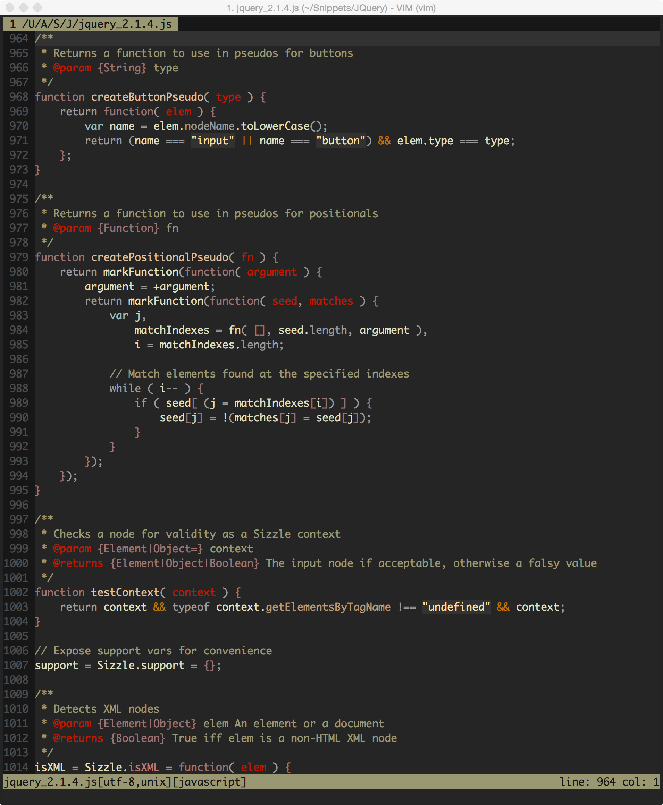
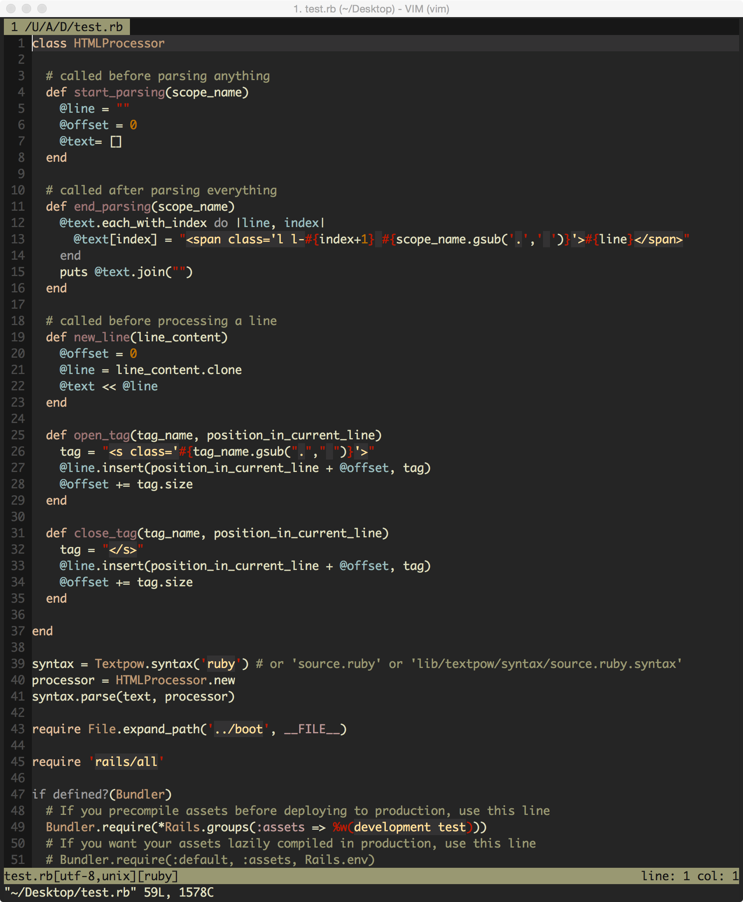
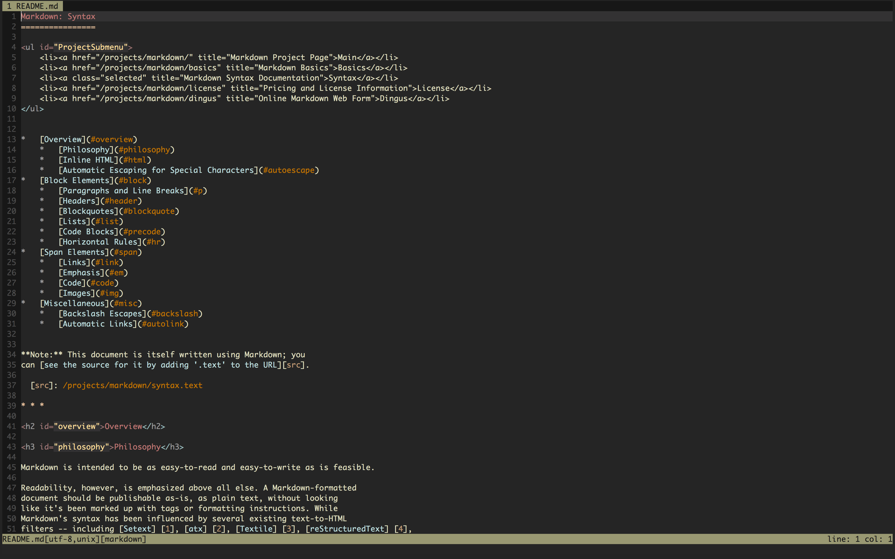

            ___                            
           -   -_, ,,  |\                  
          (  ~/||  ||   \\         '       
          (  / ||  ||  / \\ \\ \\ \\ \\/\\ 
           \/==||  || || || || || || || || 
           /_ _||  || || || || || || || || 
          (  - \\, \\  \\/  \\/\\ \\ \\ \\ 

# Alduin #

A dark low-contrast Vim colorscheme for Terminal Vim and GUI Vim. 

### Inspirations ###

The Main inspiration behind Alduin was to create a personal Colorscheme that used some of the best features from many of my favorite Vim colorschemes. I tried to mirror the low-contrast feel and look from Jeet Sukumaran's [Sorcerer](http://jeetworks.org/sorcerer/). I also, took some color palette and design cues from Ciaran McCreesh's [Inkpot](https://github.com/ciaranm/inkpot) as well as Romain Lafourcade's [Apprentice](https://github.com/romainl/Apprentice). The syntax and code inspiration came directly from Steve Losh's [Badwolf](https://github.com/sjl/badwolf)

### Screenshots ###

#### JavaScript ####

#### Ruby ####

#### HTML ####

#### CSS ####

#### C++ ####

#### Python ####

#### Markdown ####

* Enjoy!
