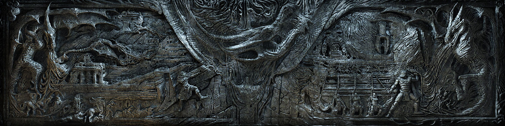
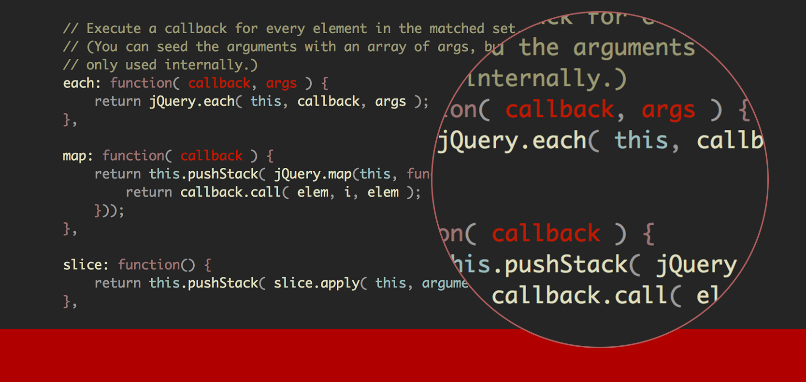
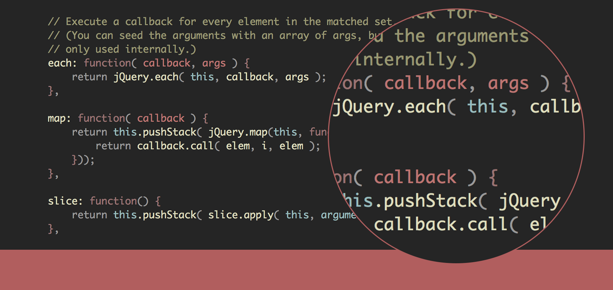

# Alduin #

A dark low-contrast Vim colorscheme for Terminal Vim and GUI Vim. 

### Inspirations ###

The idea behind Alduin was to create a dark colorscheme that combined warm yet soft colors for high readability with low distraction. Some of the features, and design cues pay homage to schemes like Jeet Sukumaran's [Sorcerer](http://jeetworks.org/sorcerer/), Ciaran McCreesh's [Inkpot](https://github.com/ciaranm/inkpot), as well as Romain Lafourcade's [Apprentice](https://github.com/romainl/Apprentice), and Steve Losh's [Badwolf](https://github.com/sjl/badwolf).

### Screenshots ###

The following screenshots of Alduin were made using a default Vi IMproved 7.3 displayed in [iTerm 2.1.4](https://www.iterm2.com) with Jose Elera Campana's Plug-in for extending the syntax for JavaScript [vim-javascript-syntax](https://github.com/jelera/vim-javascript-syntax). Enjoy!!

#### JavaScript ####

#### Ruby ####

#### Additional Screenshots ####
Additional screenshots of PHP, HTML, CSS, and others can be found in the Screenshots/ Directory

### Custom Options ###

#### Don't like the Dark Red? ####
The default forground color for highlight group "Special" is xtermfg=88 guifg=#870000

#### Don't worry Dragonborn! ####
Change it to a lighter red 

Add this bit of code to your .vimrc 

        "Replaces the Dark Red to Soft Red
        let g:alduin_Shout_Windhelm = 1
        colorscheme alduin
